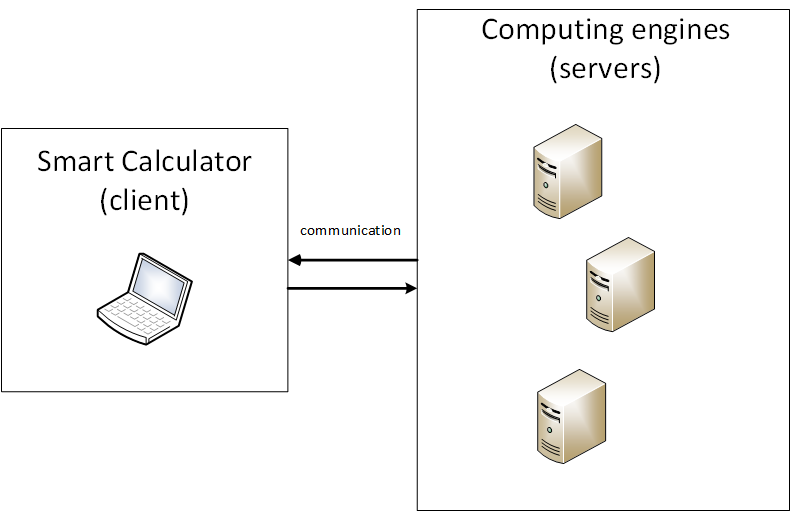
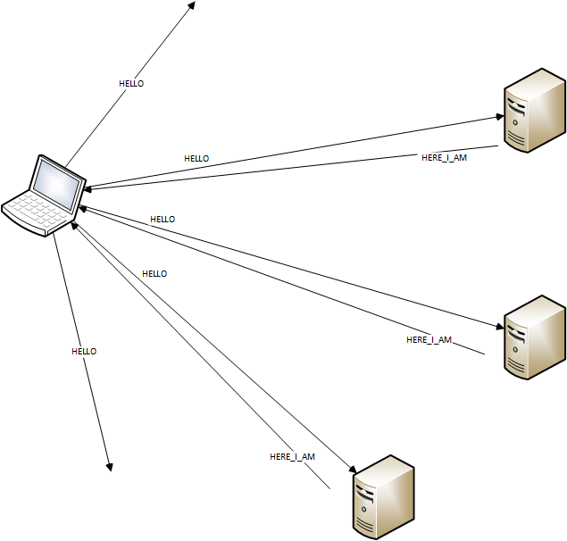
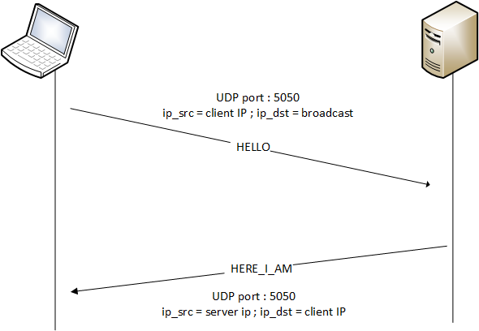
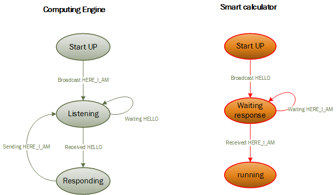
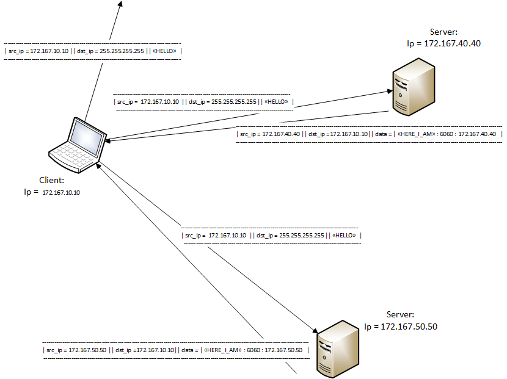
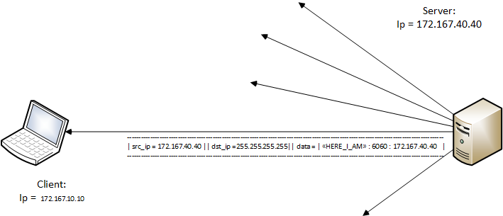

# Distributed Computing Protocol V1.0 Specification : Dynamic Discovery


```
Author              : Olivier Liechti, HEIG-VD
Last revision date  : 21.03.2014

Modified by			: Simone Righitto , Anthony Roubaty
date				: 30.03.2014

Revision history
         27.03.2014 : added messages specification
         30.03.2014 : writing chapter 1,2,3 and 5
		 30.03.2014 : completed the message specification

```

## 1. Introduction

This specification is about the Dynamic Discovery protocol used in the first step of the Distributed Computing Protocol. It is essential for a client to be able to know all computing engines before starting
speak with them. So we can say that the main goal of the discovery protocol is to let a client discovery all available Computing engines.

Just to introduce the general idea:
This protocol uses some defined messages and the broadcasting technique. 
The protocol is divided in 2 possible scenario:
- The client start up and need to discovery computing engines 
- A computing engine start up and need to announce itself to already active clients

But before starting with technical details here a brief overview of covered Chapters:
```
2. Terminology 		   : glossary section
3. System Architecture : show the system architecture (components and interactions between components)
4. Protocol Details    : important details for developers who need to implements the protocol
5. Examples			   : some example 
6. References          : ;-)
```

## 2. Terminology

>This is a glossary section, we will fix some terms that are used in this specification

**Computing engine**: the server side in the protocol. It is a machine that let a client execute commands

**Smart calculator**: the client side in the protocol. It is a machine that need a computing engine to execute commands


## 3. Protocol Overview

>The protocol is based on the idea of "I need you, where are you?" and the response "I'm at ...". Basically a client start up and need to know the IP address and port where a computing engine is listening.
The client send an HELLO message over broadcast and then listen to computing engines HERE_I_AM messages.


### 3.1. System Architecture

>Insert at least one **component diagram** here, to show a high-level overview of the system. The diagram should show the different types of components, their interfaces and their high-level interactions.

<center></center>

### 3.2. System Components

- Smart calculator : the client side of the protocol. 
- Computing engine: the server side of the protocol. 


#### 3.2.1. Smart calculator

> The smart calculator is a machine that want access at computing services provided by computing engine. The principal role of a client in this protocol is to broadcast HELLO messages at start, and to listen to HERE_I_AM computing engine response (response message that could be directly addresses to client IP or broadcasted )


#### 3.2.2. Computing engine

> The computing engine is a machine that must listen for clients HELLO message and it must provide HERE_I_AM messages. The response message is provided at a specified smart calculator when a HELLO message is recieved or it is broadcasted when the computing engine start up.

### 3.3. Interactions Between Components

>Here we can see what the discovery broadcast look like
<center></center>

>And with more details
<center></center>


## 4. Protocol Details

>In this section, we will describe all details of our Dynamic Discovery protocol.

### 4.1. Transport Protocols and Connections

>The Dynamic Discovery protocol works over UDP and uses port 5050.

>The first step before a client can establish a connection with the server it must know his address. 
Computing engines are listening over UDP (port 5050) for HELLO message from clients. When a client start up and need to connect to a computing engine it will send a HELLO message on broadcast mode
over UDP (port 5050). The server receive the HELLO call and send back an UDP datagram to the client containing his IP address and the TCP port where is listening for connection (TCP port 6060). This response message is called HERE_I_AM. 


### 4.2. State Management

>In this section we can see the state diagram of our protocol

<center></center>


#### 4.2.1. Computing engine state

#### 4.2.1.0 Start UP

>This is the first state of a computing engine. When the application start the first thing it does is send a HERE_I_AM message to inform eventual smart calculator already running that a new computer engine is disponible

#### 4.2.1.1 Listening

>After having informed all already started clients the server listen on UDP port 5050 for HELLO messages

#### 4.2.1.2 Responding

>When an HELLO message is received, the computing engine must respond to the client who has sent the HELLO with the HERE_I_AM message

#### 4.2.2. Smart calculator state

#### 4.2.2.0 StartUP

>This is the first state of smart calculator. When the application start the first thing to do is broadcast an HELLO message to receive all disponibles computing engines

#### 4.2.2.1 Waiting response

>After sending the HELLO, the client must wait for incoming HERE_I_AM messages

#### 4.2.2.2 running

>The running state is a state that is not defined on the discovery protocol. This state is intended to communicate with the server using informations received with the HERE_I_AM message and the specification
is given on the second part of the Distributed Computing Protocol.

### 4.3. Message Types, Syntax and Semantics

>In this section, we will describe in detail all type of messages exchanged during the Discovery protocol.

#### 4.3.1. UDP messages

>The next messages are used for a first contact between a client and a computing engine 

##### 4.3.1.1 HELLO
> message sent by a client who need the list of computing engines

```
--------------------------------------------------------------------
|                                                                  |
| src_ip = clientIP || dst_ip = Broadcast || data = string(HELLO)  |
|                                                                  |
--------------------------------------------------------------------

where string(HELLO) represent the string HELLO

```


##### 4.3.1.2 HERE_I_AM
> message sent by the computing engine to announce it self to the client

```
------------------------------------------------------------------------------------------------------------|
|                                                  --------------------------------------------------|      |
| src_ip = serverIP || dst_ip = clientIP || data = | string(HERE_I_AM) : TCP port number : serverIP  |      |
|                                                  --------------------------------------------------|      |
------------------------------------------------------------------------------------------------------------|

where string(HELLO) represent the string HERE_I_AM

note that the field of data are separated by ':' character. This is to be able to split out
the TCP port number and serverIP that the client must use to establish a connection with the computing engine 

```


### 4.4. Security Considerations

>At this level of the Distributed Computing Protocol, there are not security features.
The protocol don't use encryption and all informations are sent in "plaintext".
Moreover the protocol is susceptible to Man in the Middle attack. In fact everybody can send to a client a spoofed (or "gratuitous" ) UDP packet pretending to be a computing engine. The client will trust the packet and it may send sensible data to this fake computing engine.


## 5. Examples

>This is an example to illustrate a client request
<center></center>

>This example illustrate a spontaneous computing engine announcement
 <center></center>

## 6. References

> My Brain ;-)
